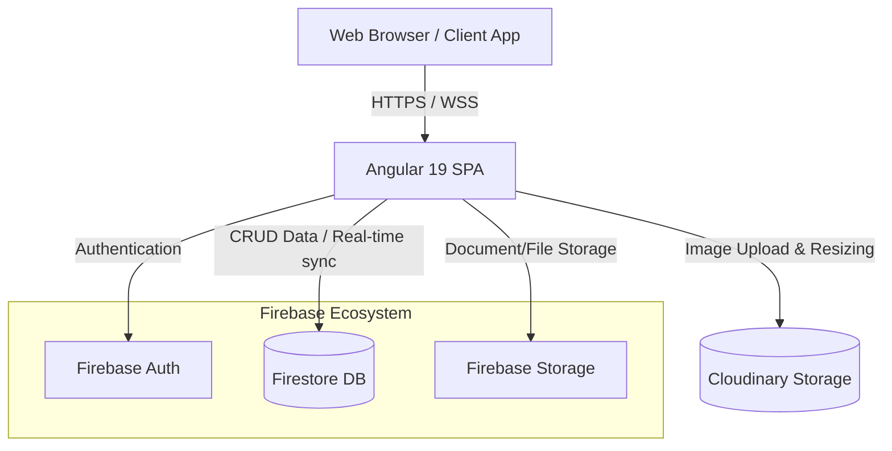
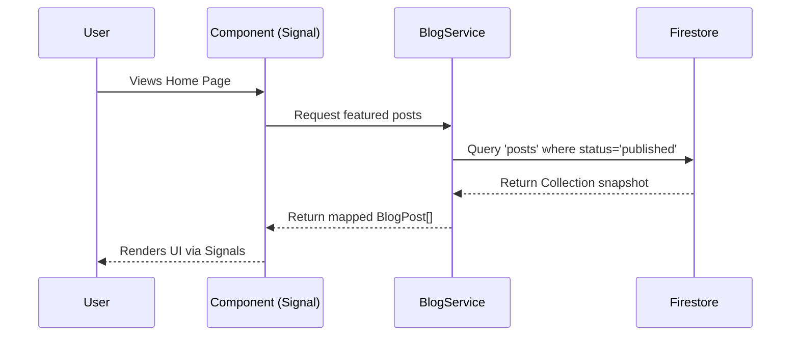

# Architecture Overview

This document provides a high-level architectural overview of the Angular 19 Blog Platform. It focuses on the reasoning behind the system's design (the "Why") and the organization of the codebase (the "Where").

## 1. System Context & Architecture

The blog platform acts as a rich content-management and delivery system. It relies heavily on modern Angular architecture on the client side and leverages Firebase as a "Backend-as-a-Service" (BaaS).



### The "Why": Core Architectural Decisions

*   **Angular 19 & Standalone Components:** We chose the latest Angular version to utilize Standalone Components, resulting in less boilerplate and eliminating `NgModules`. This pushes for better tree-shaking and component-level reusability.
*   **Zoneless Change Detection & Signals:** Rather than relying exclusively on RxJS for state changes across the component tree, the app embraces Angular Signals to achieve highly reactive, zoneless change detection. This improves rendering performance significantly.
*   **Firebase Ecosystem:** A serverless approach utilizing Firebase reduces operational overhead. 
    *   *Firestore* provides real-time document-based synchronization and is perfectly tuned for read-heavy operations like serving blog posts.
    *   *Firebase Auth* streamlines user onboarding (Google Auth & Native sign-ups) natively.
*   **Cloudinary for Image Delivery:** Instead of serving massive user-uploaded images straight from primary blob storage, Cloudinary handles automatic image optimization, caching, and on-the-fly resizing.

## 2. Directory Structure & Domain Modules

The application structurally follows a feature-driven, strictly bounded context modularization mapped onto the file system.

```mermaid
graph LR
    AppRouter((App Router))
    
    subgraph Core Layer
        AuthS[Auth Service]
        BlogS[Blog Service]
        Guards[Route Guards]
    end
    
    subgraph Features Layer
        Home[Home Module]
        Blog[Blog Module]
        User[User Profiles]
        Admin[Admin Dashboard]
    end
    
    subgraph Shared Layer
        UI[UI Components]
        Pipes[Pipes/Directives]
    end
    
    AppRouter --> Home
    AppRouter --> Blog
    AppRouter --> User
    AppRouter --> Admin
    
    Home -.-> Core Layer
    Blog -.-> Core Layer
    User -.-> Core Layer
    Admin -.-> Core Layer
    
    Home -.-> Shared Layer
    Blog -.-> Shared Layer
    User -.-> Shared Layer
    Admin -.-> Shared Layer
```

### The "Where": Where code lives and what it does

1.  **`src/app/core/` (Services & Singletons)**
    *   **Purpose:** Houses all global, singleton services. If it communicates with a database, checks authentication, or manages app-wide state, it lives here.
    *   Contains `auth.service.ts`, `blog.service.ts`, and core routing guards.
2.  **`src/app/features/` (Domain Logic)**
    *   **Purpose:** Contains the actual pages and routed components of the application. It is split by business domains (modules).
    *   **`blog/`**: Everything related to viewing, creating, or editing posts.
    *   **`admin/`**: High-privilege management interfaces (moderation, stats).
    *   **`user/`**: Profile and authored posts management.
    *   **`home/`**: Landing page logic and featured posts feeds.
3.  **`src/app/shared/` (Reusability)**
    *   **Purpose:** "Dumb" components, UI elements (buttons, modals, theme toggles), custom pipes, and directives. Components here should *never* inject services from `core` directly unless absolutely necessary; they should rely on `@Input` and `@Output` to stay decoupled.
4.  **`src/app/layout/` (Structure)**
    *   **Purpose:** Shell layout items like the global `NavbarComponent` or footer.

## 3. Data Flow & State Management

State is largely handled at the component or feature level. The primary data flow pattern is:

1.  **Component Initialization:** A specific feature component requests data via a `core` service (e.g., `BlogService.getFeaturedPosts()`).
2.  **Service Action:** The service interacts with Firestore, mapping the document payload back to a local interface (e.g., `BlogPost` model).
3.  **State Handling:** The result is assigned to an Angular Signal or RxJS Subject inside the component.
4.  **Template Binding:** The template reacts instantly based on Signal updates to render the data safely and effectively.



## 4. Security & Permissions

Security logic is applied in two layers:
1.  **Client-Side (Angular Guards):** UI boundaries are enforced by `AdminGuard`, `AuthorGuard`, and `AuthGuard` protecting specific local routes from unauthorized access. The source of truth for current state lives in `AuthService`.
2.  **Server-Side (Firestore Rules):** Final validation occurs on Google's backend. A user flagged as a "Reader" in their user document cannot artificially spoof a write request to a Blog Post document.
